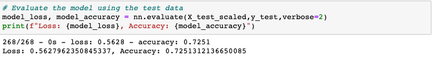
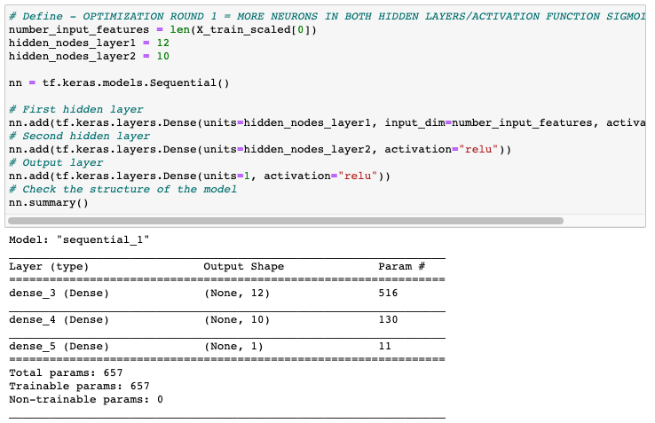
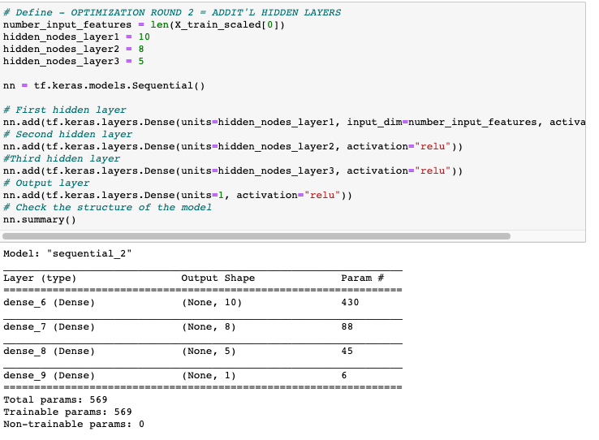

# Neural_Network_Charity_Analysis
## Overview
The purpose of this analysis is to explore contributing factors to successfull investments based on Alphabet Soup's dataset, in the hopes that Alphabet Soup is better able to evaluate future applications that are more likely to be successful.

## Results
### Data Preprocessing
- This model's target variable is "IS_SUCCESSFUL" variable
- Feature variables for this model include 'AFFILIATION', 'CLASSIFICATION', 'USE_CASE', 'ORGANIZATION'(TYPE), 'STATUS'(ACTIVE), 'INCOME_AMT', 'SPECIAL_CONSIDERATIONS', and 'ASK_AMT'.
- Identifying variables ('EIN' ID number and 'NAME') would not be contributing factors to success of investment and are removed as part of data preprocessing.
### Compiling, Training, and Evaluating Model
- For initial model, two layers (1st containing 8 neurons, 2nd containing 5) were applied along with a sigmoid activation feature. For neuron layers, too many layers and too many neurons are likely to contribute to over-classification. With activiation features, progression would be first sigmoid, then tanh, then reLU, and lastly Leaky ReLU in order to progress optimization with higher complexity without overclassification.
- The goal of the model was 75% accuracy. Initial model achieved 72% accuracy (0.7229) 

- Three attempts at optimization resulted in slightly decreased accuracy (0.7146 and 0.7220) with one slightly more accurate model at 73% (0.7257). None of the optimization attempts were able to achieve the goal of 75% accuracy.

- In attempts to optimize and improve performance, the following adjustments were made to model:
  * Additional neurons were added to each of the two hidden layers.
  * Activation function changed to reLU.
  
  * Additional hidden layer.
  
  * Adjust input data (drop column) that may be contributing to confusion
  
  
## Summary
- Given the desired outcome of binary classification (Success or no success) - a logistic regression or Support Vector Machine model may be a better fit for this purpose. Most likely, SVM would provide a higher accuracy based on its ability to create multidimensional borders. For this purpose, neural networks may be more prone to overfitting.
